# Лабораторная работа №9

## Задание

Реализовать краулера с использованием шаблона *producer-consumer*.
> Краулер — программа, предназначенная для обхода страниц Интернета с целью получения из них необходимой информации.

### Требования
1. Программе на вход подаются следующие аргументы:
    * адрес HTML страницы `--url`;
    * глубина поиска по странице `--depth`;
    * количество потоков для скачивания страниц `--network_threads`;
    * количество потоков для обработки страниц `--parser_threads`;
    * путь до выходного файла `--output`.
1. Программа должна рекурсивно обойти все ссылки встречающиеся на странице. Начальная страница обхода передается аргументом командной строки `url`. Глубина обхода равна `depth`.
1. Программа должна записать в выходной файл `output` все ссылки на изображения, которые встречаются при обходе страниц.
1. Необходимо использовать шаблон producer-consumer. Количество `producer` задается аргументом командной строки `network_threads`, а количество `consumer` - аргументом `parser_threads`.
1. Для процессинга страниц необходимо использовать [gumbo-parser](https://github.com/google/gumbo-parser).
1. Для скачивания HTML страниц необходимо использовать [Boost::Beast](https://github.com/boostorg/beast).
1. Для обработки параметров командной строки необходимо использовать компонент `boost::program_options`.

## Шаблон producer-consumer
Шаблон "producer-consumer" устроен по следующей схеме:

> Этот шаблон часто применяется в высоконагруженных системах, распределенных вычислениях. Почти всегда можно абстрагировать задачу и выделить в ней части, которые делают некоторый препроцессинг, и части, которые занимаются окончательной обработкой данных на основе этого препроцессинга. Этот шаблон - это обобщение принципа подобного разделения.

**Producer**, или "поставщик", — это некоторый поток, который генерирует "задания" и складывает их в очередь.

**Consumer**, или "потребитель", — это поток, который обрабатывает "задачи" из очереди.

В качестве **задачи** может выступать любая сущность, требующая дополнительной обработки. В текущем случае, это HTML страница.

## Рекомендации
1. Используйте пул потоков. Например, [ThreadPool](https://github.com/progschj/ThreadPool).
1. Все необходимые примеры по работе с [gumbo-parser](https://github.com/google/gumbo-parser) есть по [ссылке](https://github.com/google/gumbo-parser/tree/master/examples).
1. При решении задачи следует использовать шаблон procuder-consumer два раза, по следующей схеме:

